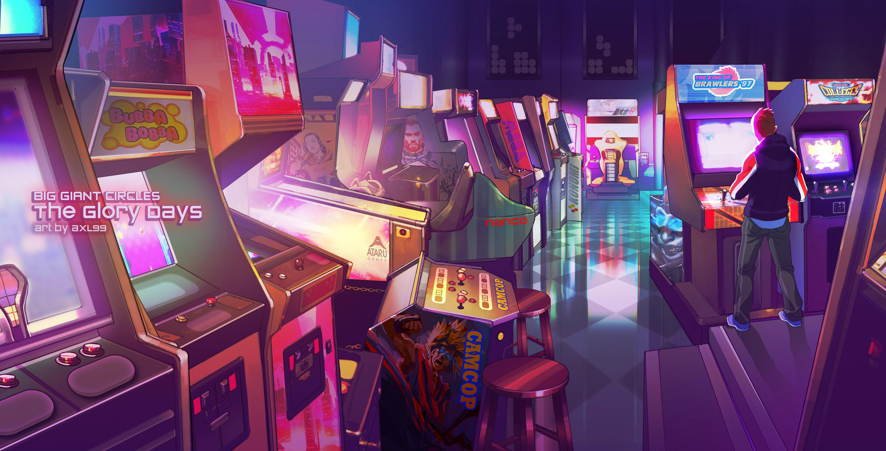
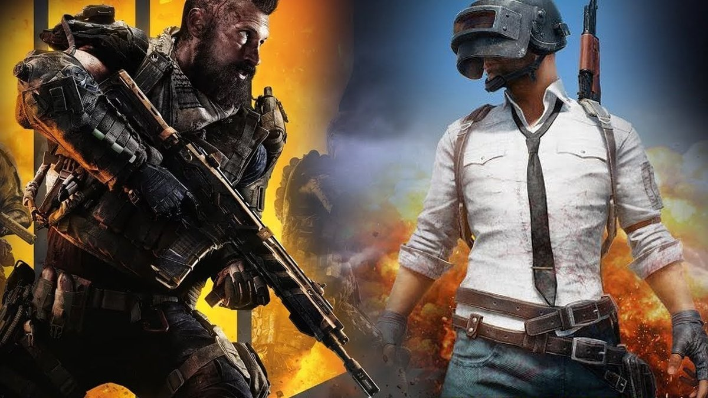
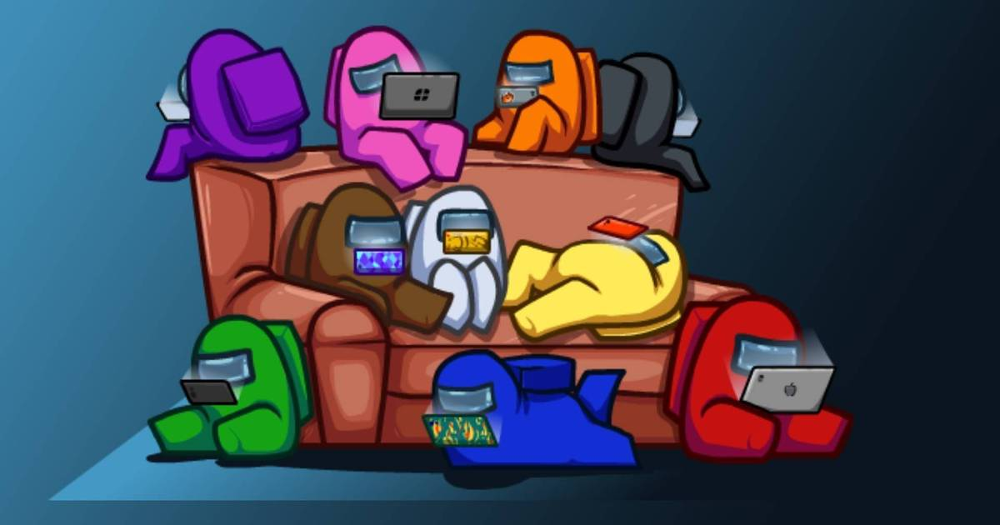

As a university student, my time is limited and my budget is not very high for external activities, however, Video Games fall into a strange category in which they can be totally free or extremely expensive and they give you a range of genres that allow you to be a casual player or a hardcore fan. In this case, I have been both, a casual player with games like Dokkan Battle, Stardew Valley, Minecraft, and a hardcore fan for games like the Pokemon series, The Legend of Zelda: Breath of the Wild, and Apex Legends.

You may be wondering how Video Games can be an appropriate hobby for a student that is making a serious career when they are normally associated with children and a “waste of time”, but in my experience, they have granted me a break from a monotonous and sometimes boring routine. Video Games allow me to escape to a place where my problems are irrelevant and I can forget about them for a while to just concentrate on what I have in front of me. Furthermore, they have been linked to help creative thinking, problem-solving and exercise the brain by tanking us out of our comfort zone.

\
So, if you are looking for a new hobby and are even mildly interested in Video Games I recommend you to look for a genre of games that will help you pass the time and help you how it has helped me. Lastly, I will add a few recommendations on some of my favorite games that might catch your attention:

**First Person Shooters/Battle Royals:**

* Fortnite (PC/Console/Phone) (Free)
* CoD Warzone (PC/Console) (Free)
* Apex Legends (PC/Console) (Free)
* CoD Mobile and PUBG Mobile (Phone) (Free)
* Tetris 99 (Console) (Free)
* Doom Eternal (Console) ($59.99)
* CoD WW2 (Console) ($49.99)

\
**More Relaxed Games (Gacha, Roleplaying, Open World, etc)**

* Stardew Valley (PC/Console) ($14.99)
* Minecraft (PC/Console) ($26.95)
* The Legend Of Zelda: BTW (Console) ($59.99)
* Pokemon Sword/Shield (Console) ($60)
* DBZ Dokkan Battle (Phone) (Free)
* Among Us (PC/Phone) (Free)
* Fall Guys (Console) (Free)

  